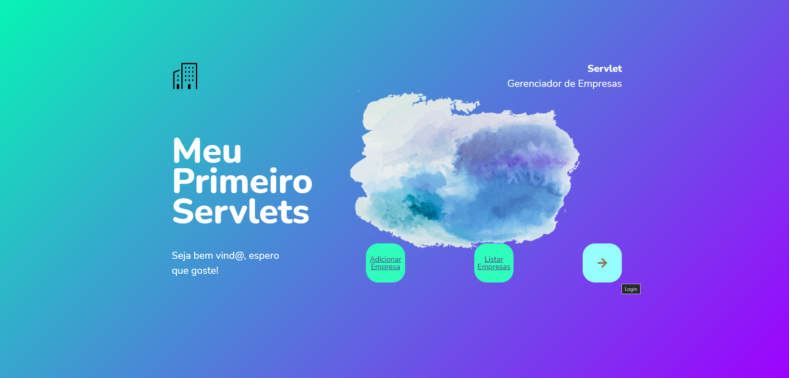

<h1 align="center">
    Java Servlet: Fundamentos da programação web Java
</h1>

  <a href="#-tecnologias">Tecnologias</a>&nbsp;&nbsp;&nbsp;|&nbsp;&nbsp;&nbsp;
  <a href="#-projeto">Projeto</a>&nbsp;&nbsp;&nbsp;|&nbsp;&nbsp;&nbsp;
  <a href="#memo-licença">Licença</a>

 

  

 

    

 

## 🚀 Tecnologias

Esses códigos foram desenvolvidos com as seguintes tecnologias:

- [Java™ Platform, Standard Edition 8](https://docs.oracle.co/javase/8/docs/api/index.html)
- [Apache Tomcat V9](https://tomcat.apache.org/tomcat-9.0-doc/index.html)
- [IntelliJ IDEA](https://www.jetbrains.com/idea/)
- [CSS](https://developer.mozilla.org/pt-BR/docs/Web/CSS)
- [Maven](https://maven.apache.org/guides/index.html)
 

## 💻 Projeto

🚀 O repositório tem como propósito compartilhar o conhecimento absorvido juntamente com os códigos desenvolvidos no curso [Java Servlet: Fundamentos da programação web Java](https://cursos.alura.com.br/course/servlets-fundamentos-programacao-web-java) e o curso [Java Servlet: Autenticação, autorização e o padrão MVC](https://cursos.alura.com.br/course/servlet-autenticacao-autorizacao-mvc) proporcionado pela Alura.

⚡️ Criei resumos e anotações no Notion das partes relevantes com a minha visão de aluno. [Clique aqui para conferir.](https://www.notion.so/Spring-Framework-6c29e51bad174a849500a5ba8701615f)

✨ Servlet é um objeto que pode ser acionado através de uma requisição do protocolo HTTP. Essa interação é possibilitada pelo Tomcat que é um Servlet Container, e precisa seguir algumas regras, como estender, sobrescrever os métodos doGet(), doPost() e service(), e fazer o mapeamento para indicar a URL.

👾 O foco foi realmente nos servlets e no back-end, aplicando o C.R.U.D (Create, Read, Update, Delete), usando uma classe banco, que simula um banco de dados a princípio, adicionalmente ao que foi ensinado no curso, fiz um front-end básico na landing page (index) e criei um atributo adicional 'CNPJ' com a propriedade readonly. 

:coffee: Através da arquitetura MVC, nós definimos bem as nossas camadas e criamos nosos próprio framework, com HTML simples no JSP, mas com todos os recursos - como um *clutch* completo e autenticação e autorização com filtros. 

📫 Espero que goste, qualquer dúvida ou sugestão me encontro a disposição! [LinkedIn](https://www.linkedin.com/in/brunooliveira13/)

 

## :memo: Licença

Esse projeto está sob a licença MIT. Veja o arquivo [LICENSE](LICENSE.md) para mais detalhes.

---

Códigos feitos com ♥ by Bruno Oliveira durante o cursos da formação Spring Framework da [Alura](https://cursos.alura.com.br/formacao-spring-framework). :blue_heart: 

 